  

<h1>Hey, I'm Dhruv 👋🏻 </h1>

  Second-year CS @ <strong>Scaler × BITS Pilani</strong>. SDE Intern @ <strong>Scaler AI Labs</strong> —
  building RL training environments used by <em>OpenAI, xAI, Meta and Anthropic</em>.
  I ship at the intersection of <strong>agents, dev tooling, and craft</strong>.

---

### 🚀 What I'm shipping

- **[Stradix](https://stradix.site)** — autonomous CI agent that diagnoses, fixes, verifies and merges broken builds in ~90s. *(TypeScript · React · Three.js · GitHub Actions API · Claude)*
- **[TradeX](https://github.com/Dhruv-Davda/TradeX)** — TypeScript-first trade management for gold/silver merchants — inventory, P&L, real-time analytics on a React + Supabase stack
- **[Lost & Found](#)** — semantic search on text + image embeddings (CNN/CLIP, cosine similarity), with optimized vector retrieval

### 🛠️ Stack

### ⚡ Numbers

- **700+** DSA problems solved across LeetCode + Codeforces
- Open-source contributor — GitHub, GsSoC, Hactoberfest, Discord dev communities

### 📬 Reach me

